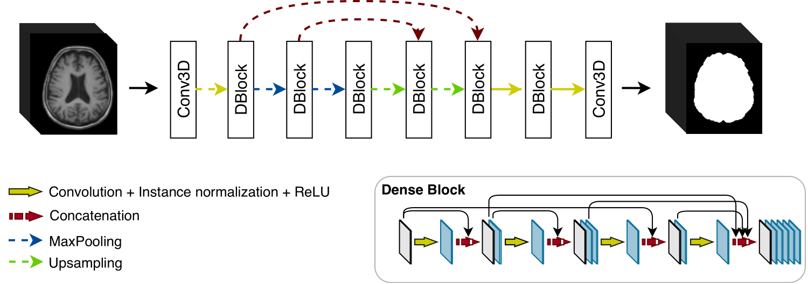

# DeConvBET

The official implementation of the paper `DeConvBET: Densely Connected 3D Convolutional Network for Brain ExTraction`.

## Abstract

As automated, pipeline-based processing of neuroimaging data becomes increasingly prevalent, the need for reproducible
and transparent methods grows. The first step of many processing pipelines is the removal of non-brain tissue from the
images. Most automated brain extraction algorithms are optimised for processing healthy brains. Therefore, these
approaches frequently fail in pathologically altered brains or when applied to heterogeneous MRI modalities, vendors,
field strengths. To overcome these limitations, we introduce a method that relies on a densely connected neural network.
We evaluated the performance of four state-of-the-art approaches on four publicly available datasets.

## Method

## License

This repository is released under the Apache 2.0 license as found in the [LICENSE](LICENSE.md) file.
